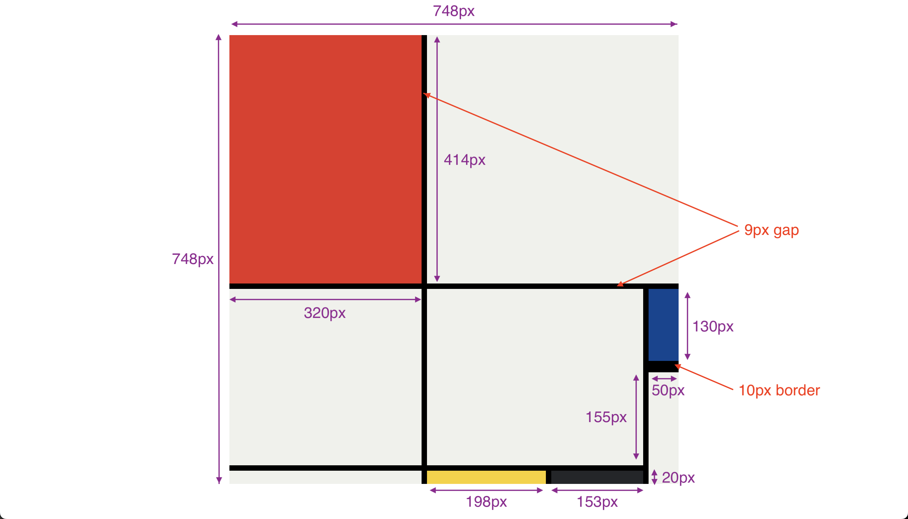

# 🏴‍☠️ Exercise: Recreate a Mondrian Painting with CSS Grid

This project challenges you to recreate an iconic Mondrian painting using **CSS Grid**. It focuses on mastering grid layouts, positioning, and responsive design.

## 🎯 Project Objectives

- 🖌️ Use **CSS Grid** to replicate a complex layout.
- 🎨 Explore techniques for centering content within the viewport.
- 🛠️ Apply best practices for responsive design and flexible layouts.

## 📂 Included Files

- **📄 index.html**: Contains the HTML structure of the painting.
- **🎨 style.css**: Contains the CSS styles for the grid layout and positioning.

## 📂 Key Concepts

### CSS Grid:

- Use **`grid-template-rows`** and **`grid-template-columns`** to define the grid layout.
- Apply **`gap`** to create spacing between grid items.
- Assign grid items to specific areas using **`grid-column`** and **`grid-row`**.

### Centering the Layout:

- Center the Mondrian painting using `display: flex` or `grid` on the body element.
- Set the background color of the body to **`#212121`** for contrast.

## 🔍 Design Preview

The final painting should resemble this iconic piece of art:

